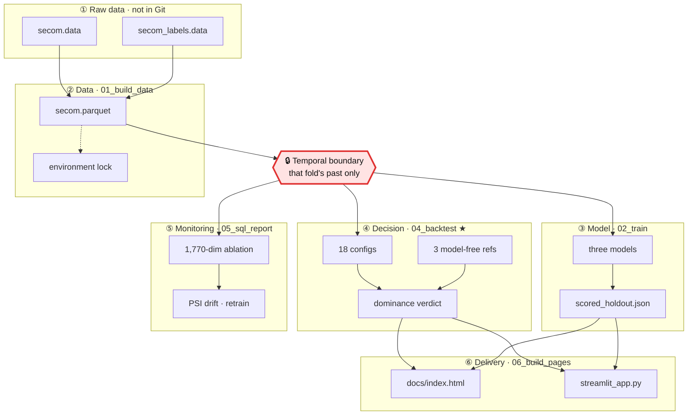

# Is this model worth deploying — a cost-sensitive decision evaluation

[](https://github.com/mina201199/secom-cost-sensitive-eval/actions/workflows/ci.yml)

**▶ [Interactive cost explorer](https://mina201199.github.io/secom-cost-sensitive-eval/)** — no install; change the cost and capacity assumptions and watch the policy respond

[繁體中文](README.zh-TW.md) · [Generated experiment report](reports/executive_summary.md)

**The shape of the problem:** many items to screen, fewer than 5% of them actually bad (4.7% pooled across the four evaluation windows), a hard cap on how many can be checked, missing one costing **30×** what checking one costs, and a data distribution that drifts over time. Who should be checked first?

That shape is not specific to semiconductors — it is inspection scheduling in manufacturing, AML alert triage and fraud review queues in banking, and screening triage in medicine. This project uses the public [UCI SECOM](https://archive.ics.uci.edu/dataset/179/secom) yield dataset as its vehicle.

**Most projects ask whether a model is accurate; this one asks whether a model is worth using**: spend a limited inspection budget according to the model's scores, and does the total cost come in below using no model at all? That makes it a deployment decision rather than an accuracy contest — so the comparison set is "always inspect everything" and "sample at random", not another model.

## The finding, first

**It does not — and the value of this project is that it quantifies why.**

Eighteen model × policy × capacity configurations were compared on identical future windows with walk-forward backtesting, against three fixed policies that use no model at all:

| Capacity regime | Cheapest model-free policy | Cost/unit | Cheapest model-driven config | Cost/unit | Configs beating model-free |
| --- | --- | ---: | --- | ---: | :---: |
| Unconstrained | Always inspect everything | **2,000** | majority/robust\* | 2,000 | **0 / 9** |
| At most 20% inspected | Random at the same quota | **2,644** | lgbm/threshold | 2,677 | **0 / 9** |

\* Read that cell carefully: `majority` is a zero-information DummyClassifier whose conservative policy degenerates to inspecting 100%, so that 2,000 *is* full inspection wearing a model's name — it ties the model-free reference rather than beating it (the verdict uses a strict inequality). Every configuration that actually uses ranking is more expensive: the cheapest LightGBM configuration in the unconstrained regime is `lgbm/robust` at 2,042.

Four quantitative results support the conclusion:

- **The bar can be computed in advance.** With R = escape cost ÷ inspection cost and p = prevalence, whenever p·R ≥ 1 (here 1.40) the condition for a model to add value reduces to **lift > 1** — at the same inspection quota, the model's selection must be denser in failures than random sampling. The measured median lift@20% across four windows is **0.86**.
- **Permutation test p = 0.52.** The flagged set is indistinguishable in cost from a random set at the same quota.
- **The 95% bootstrap interval for the cost difference straddles zero** (relative saving −23.5% to +15.9%), and the model is cheaper in only 43.6% of resamples.
- **This design cannot see a small signal in the first place.** With 33 positives the minimum detectable ROC-AUC is **0.644**; the measured value sits near 0.5, so it neither establishes nor refutes usefulness — it establishes that the sample size cannot answer the question. Detecting AUC 0.60 needs roughly 69 failures (2.1×).


Drift analysis supplies the mechanism. Against the first fold's training window, PSI is computable for 452 of the 590 sensors — the remaining 138 are entirely missing (16) or constant (122) in that window, so no quantile bins exist and their PSI is undefined rather than zero. Among those 452, the share drifting past PSI > 0.25 rises monotonically across the four evaluation windows: **61% → 64% → 70% → 75%**. The model is not failing to learn; it is being asked to extrapolate onto distributions it never saw.


The generated report is the single source for current numbers, assumptions and limitations. The previous +12.4% and 8.7:1 claims are superseded.

## Data and assumptions

[UCI SECOM](https://archive.ics.uci.edu/dataset/179/secom) contains 1,567 observations and 104 failures. The raw sensor file has 590 columns, of which 116 are constant across the dataset, and 4.5% of all cells are missing; the repository validates the parsed file rather than relying on the differing column count in UCI's page description.

Labels describe in-house pass/fail tests, not observed customer escapes. Treating each observation as an independently inspectable unit, perfect interception of inspected failures, and costs of TWD 2,000 per inspection and TWD 60,000 per escape are scenario assumptions. Sensor availability at the intended decision time requires confirmation.

**The cost assumption itself sets the difficulty.** At 2,000 : 60,000 we get p·R = 1.40 > 1, which places the scenario in the region where a model only has to beat random sampling — the most permissive region available to it. It did not.

## Evaluation protocol

- Chronological outer windows. Preprocessing and LightGBM bin construction are fitted separately inside each inner training fold.
- Final tree count is selected by the mean inner validation AUC curve. Earlier OOF calibration predictions use a tree count fixed in advance, avoiding retrospective hyperparameter selection for those predictions.
- Calibration and decision selection share a calibration window; scores on that window are not independent results. Performance is measured in the next window.
- Each cost ratio selects a threshold on validation and measures its cost on future observations. There is no test-optimized deployment break-even claim.
- Three models, three policies, and two capacity regimes share identical future windows. Feasible baselines are selected using calibration labels, not evaluation labels.
- **That prospectively selected baseline can pick wrong**, so the headline conclusion is measured against fixed model-free policies instead — they never get the chance to pick wrong, which makes them harder to argue with.
- Retain zero-failure windows for cost evaluation, mark undefined metrics as null, and include remaining observations in the final fold.
- The SQL ablation creates historical deviations for all sensors; it does not select sensors using test-set SHAP rankings.

Quantile decisions assume that the entire decision batch is available for ranking. This is not an online, one-observation-at-a-time simulation. Boundary ties are excluded together, so capacity may be underused. Historical SQL features use the preceding 20 rows; tied timestamps follow input sequence, assumed available operationally.

## Disclosed because it will be asked

- **The "conservative" policy is not a robustification; it is a switch to near-full inspection.** The Clopper–Pearson upper bound inflates escape cost by 1.42–1.95× (per fold), pushing p·λ·R past 1, so the optimal inspection fraction saturates (the four folds select 86% / 28% / 98% / 95%). Its cost improvement comes from the inspection rate, not from ranking.
- **Calibration does not affect all three policies.** Platt scaling is monotone and the quantile policies use only the ordering, so calibration leaves their decisions unchanged; only the absolute-threshold policy uses the probability scale. `test_calibration_does_not_change_rank_based_decisions` verifies this directly.
- **The `min_estimators: 10` floor actually binds.** It is not dormant insurance. Hitting it means the mean inner-CV AUC peaked in under ten trees and then declined.
- **AUC is deliberately excluded from the retraining trigger.** At 33 positives its fluctuation exceeds any real change, so using it as a trigger would only manufacture false alarms.

## Experiments

| Component | Comparison |
| --- | --- |
| Models | Dummy prior, L2 logistic regression, LightGBM |
| Policies | Absolute threshold, quantile, conservative base-rate adjustment |
| Capacity | Unconstrained, at most 20% inspected |
| Model-free references | Inspect nothing, inspect everything, random at an integer quota |
| Metrics | Average precision, ROC-AUC, Brier, lift@20%, interception, cost, variation across windows |
| Uncertainty | Minimum detectable effect, bootstrap interval for cost difference, exact permutation test against random selection |
| Monitoring | Prevalence-regime call anchored on the break-even rate, feature PSI, retraining trigger |
| Ablation | 590 raw sensors vs 1,180 additional historical deviations |

SHAP describes model dependence on anonymous columns, not causality or actionable manufacturing settings.

## Architecture

Six layers between two raw UCI files and a one-page static explorer anyone can open. The red cell is the leakage boundary.



The red cell is the tightest step in the pipeline. With 1,567 rows and 104 failures, any leak of future information into training is enough to flip the conclusion — and the most common cheat in cost-sensitive work is exactly this one: choosing the threshold on the test set. This repo did it once, and the earlier deployment break-even claim was withdrawn because of it.

The rule now: every fold refits preprocessing, reruns the inner CV, recalibrates and reselects its threshold, using that fold's training window and nothing else; thresholds are fixed on the calibration window and priced on the **next** window; the SQL history window excludes the current row. `tests/test_no_leakage.py` guards that line, and CI downloads the raw UCI files precisely so those tests actually execute rather than being silently skipped when no data is present.

Two deliberate choices in the drawing: **the three model-free references in ④ bypass the model layer entirely**, because they need no model — that is the whole point of the comparison. **`03_decide.py` is not drawn**: it covers a single split only and serves as an appendix, not as a source of conclusions.


## Reproduce

```bash
pip install -e ".[dev]"
python scripts/01_build_data.py
python scripts/02_train.py
python scripts/03_decide.py
python scripts/04_backtest.py
python scripts/05_sql_report.py
python scripts/06_build_pages.py
python -m pytest tests/
ruff check .
streamlit run app/streamlit_app.py
```

Run scripts in order: 03 writes the single-split report (comparison only, now demoted to an appendix), 04 produces the headline conclusion and the uncertainty quantification, and 05 adds the ablation and drift monitoring. The whole pipeline takes about 40 seconds.

**On Windows, clone to a short path.** `pip install -e ".[dev]"` can fail while unpacking Streamlit with `OSError: [Errno 2] No such file or directory` on a path ending in `streamlit/.agents/skills/.../dashboard-companies/streamlit_app.py`. That is the 260-character `MAX_PATH` limit, not a problem with this project — Streamlit ships files nested deeply enough that a long clone path pushes them over. Cloning somewhere shorter (`C:\dev\secom`) is the one-step fix; enabling `LongPathsEnabled` works too but needs a registry change and a reboot.

The dashboard pins the walk-forward verdict to the top of the page, read straight from `backtest.json`, so it cannot contradict the report. Its sidebar controls drive the single-split appendix scenario; the rolling tables below show saved experiments at configuration-file costs, including the model-free reference policies.

**The dashboard runs standalone — no training step required.** It reads two
small version-controlled files (`reports/metrics/scored_holdout.json`, about
20 KB, plus `backtest.json`) rather than the 7.5 MB `models/fitted.pkl`, and it
never touches `data/`. A fresh clone can run `streamlit run app/streamlit_app.py`
immediately, which is also what makes it deployable to a hosted platform. The
leading `.` in `requirements.txt` exists for that: hosted platforms run only
`pip install -r requirements.txt`, never `pip install -e .`.

`requirements.txt` states compatible lower bounds (intent); `requirements-lock.txt` and `reports/metrics/environment.json` record the actual validated versions (fact). Both are generated by `01_build_data.py` from installed package metadata rather than maintained by hand. Fixed seeds aid reproducibility, but byte-identical outputs across versions and platforms are **not** guaranteed.

### Measured from a clean clone

Cloned from GitHub into a fresh virtualenv and run end to end with exactly the commands above:

| Step | Result |
| --- | ---: |
| Clone size | 2.6 MB (1.3 MB working tree + 1.3 MB `.git`) |
| `pip install -e ".[dev]"` | 200 s — download-bound, so treat it as an order of magnitude |
| Scripts 01 → 06, including the UCI download | **42 s** |
| `pytest tests/` | 76 passed, 10 s |
| `ruff check .` | clean |
| Dashboard `healthz` | 200 after ~2 s |

Every timing in the table comes from that one clean clone. The test count has risen since, with the addition of the architecture-diagram guards; the timings were not re-measured — a count is a property of the code and independent of the environment, a duration is not.

That clean environment again resolved most direct dependencies to versions other than the recorded ones — pandas across a major version (3.0.6), scikit-learn 1.9.1, matplotlib 3.11.2 — and `reports/executive_summary.md` again came out **byte-identical** to the committed copy.

What is *not* byte-identical is worth stating precisely, because the report being identical could otherwise be mistaken for a stronger claim than it is. The nine figures differ (a different matplotlib renders different PNG bytes), and across `backtest.json`, `sql_ablation.json` and `model_scores.json` **42 numeric fields differ — by at most 3.3 × 10⁻¹⁴ relative**, all of them thresholds and float metrics. **No integer field moves at all**: every interception count, escape count, window size and configuration count is identical, which is why every discrete conclusion survives and why the rounded report renders the same.

That is still an observation, not a guarantee: two reproductions do not support a cross-version stability claim, so the sentence above stands.

## Limitations

Four windows and few positive examples provide limited evidence. The methodology changes were informed by earlier results on these same observations; they need confirmation on a genuinely unseen period. OOF and final estimators also differ in training size and tree count, so calibration transfer remains a limitation.

The power analysis gives concrete targets for what "more data" means: detecting AUC 0.60 needs roughly 69 failures across 1,468 observations; AUC 0.55 needs roughly 275 failures across 5,872. Obtain decision-time feature definitions, real costs, and inspection effectiveness before prospective validation.

**A negative result here is not proof that no model can find signal.** It establishes that at this sample size, this granularity, and this set of cost assumptions, the question cannot be answered.

See [the report](reports/executive_summary.md) for current findings and [the Chinese README](README.zh-TW.md) for the file map.

## License

MIT — see [LICENSE](LICENSE). The UCI SECOM data is not redistributed here; `scripts/01_build_data.py` downloads it from the source.
