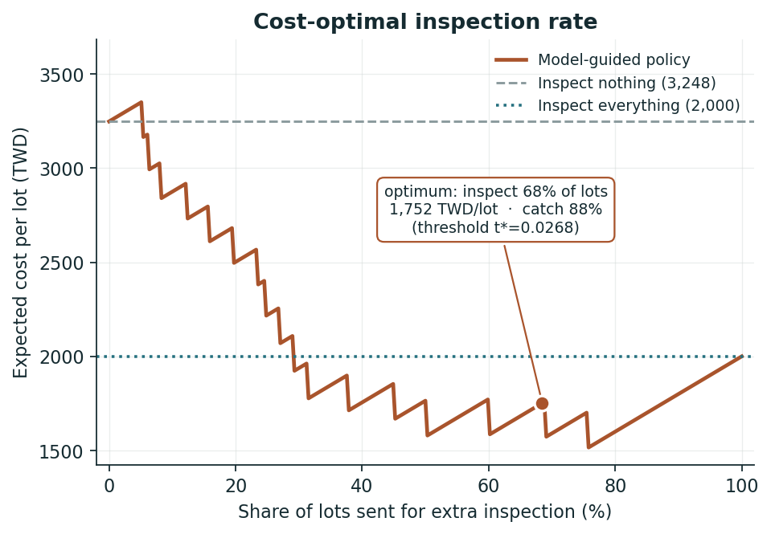
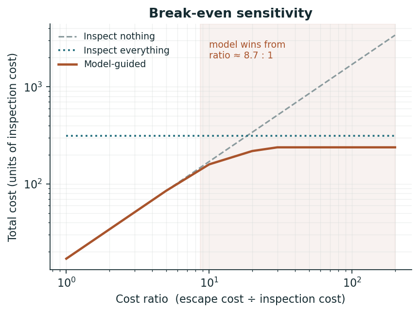
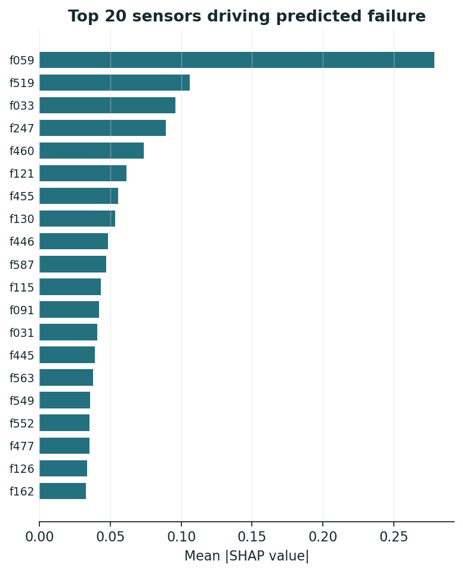

# 半導體測試線的加驗決策引擎

**問題**：測試線上每一批都可以「直接放行」或「加驗」。加驗要花錢，漏放一批壞品到客戶端的代價高一個數量級。該對哪些批次加驗？

**結論**：在加驗:流出成本比 30:1 的假設下，模型導向的加驗策略讓**每批期望成本從 2,000 降到 1,752 TWD（−12.4%）**，攔截率 88.2%。損益兩平點約在成本比 **8.7:1** —— 低於這個比值，直接全檢更省，模型不值得上線。



這個專題刻意不停在「模型分數」。分數不能拿去跟財務討論，錢可以。

---

## 為什麼這個專題長這樣

我做過 IC 測試業的專案管理，看過 alarm 進到產線之後 OP 要怎麼動作。所以這裡的重點不是把 AUC 推高一個小數點，而是三件在現場真正決定成敗的事：

| | 大多數 SECOM 公開 notebook | 這個 repo |
| --- | --- | --- |
| 切分 | 隨機切分 | **依時間切分**（製程會漂移，隨機切分等於偷看未來） |
| 指標 | accuracy 0.93 | **PR-AUC、recall@k**（accuracy 在 6.6% 盛行率下毫無意義） |
| 結尾 | 混淆矩陣 | **成本最佳門檻、損益兩平比、產能約束下的可行性** |

---

## 快速開始

```bash
python scripts/01_build_data.py && python scripts/02_train.py && python scripts/03_decide.py
```

資料從 UCI 直接下載，**不需要 Kaggle API token**。三個腳本跑完約一分鐘，會產出 `reports/` 下的圖表、指標 JSON 和一頁式報告。

互動式儀表板（拉成本 slider 看最佳門檻怎麼移動）：

```bash
streamlit run app/streamlit_app.py
```

依賴套件：

```bash
pip install -r requirements.txt
```

---

## 資料

[UCI SECOM](https://archive.ics.uci.edu/dataset/179/secom)：某座半導體廠 2008-07-19 到 2008-10-17 的產線量測紀錄。

| | |
| --- | --- |
| 批次數 | 1,567 |
| 感測器特徵 | 590（匿名，`f000`–`f589`） |
| fail | 104（6.64%，不平衡 1:14.1） |
| 缺值 | 41,951 格（4.54%） |
| 零變異欄位 | 116 |
| 涵蓋期間 | 89 天 |

### 兩個影響全部設計決策的資料事實

**1. 良率隨時間大幅漂移。** fail 率從 7 月中的 22% 一路降到 10 月中的 1.8%（典型的製程 ramp）。

這直接推翻隨機切分：隨機切下去，早期的高失效批次會同時出現在 train 和 test，模型只要學會「這是早期批次」就能拿高分，上線後立刻崩掉。所有聲稱在 SECOM 上做到 0.95+ AUC 的結果，幾乎都來自這個洩漏，或來自在切分前就做了取樣／填補。

漂移也讓驗證集只剩 11 個 fail，這件事在下面的方法論裡造成連鎖後果。

**2. 特徵是匿名的。** 只有 `f000`–`f589`，沒有對應的站點或參數名稱。所以 SHAP 只能給出索引，給不出「哪一台機器的哪個參數」。方法可以轉移，結論不能 —— 真實廠內這一步的產出會是可直接交給製程工程師的「站點 + 參數」清單。

---

## 方法論：三個踩過的坑

這一節是本 repo 最值得看的部分。三個問題都是實作過程中被數字打臉才發現的，修法都留在程式碼註解裡。

### 坑 1：`startswith("f")` 把標籤欄也當成特徵

篩特徵欄時寫了 `[c for c in df.columns if c.startswith("f")]`，而標籤欄叫 `fail` —— 它也以 `f` 開頭。特徵數印出 591 而不是 590 時才發現。如果沒發現，模型會直接拿到答案。

改用嚴格比對 `^f\d{3}$`（[`secom/data.py`](secom/data.py)）。註解留在原地當提醒。

### 坑 2：用驗證集早停，停在第 1 棵樹

val 只有 11 個 fail，PR-AUC 在這個樣本量下是純噪音。第一版早停在**第 1 棵樹**就收工。

更糟的是，val 原本要同時做三件事：早停、校準、選門檻。一份資料做三件事就是三次偷看。

改法（[`secom/models.py`](secom/models.py)）：樹的棵數改用 **train 內部的擴張窗 CV** 決定，val 從此不參與訓練。而且不取「各折 best_iteration 的中位數」—— 各折的 argmax 實測是 `[2, 1, 88]`，抖得沒有意義，中位數只是把噪音傳下去。改成先把各折驗證曲線**逐輪平均**再取極大值，等於用三倍樣本估同一件事。最終得到 19 棵樹。

早停指標用 AUC 而非 PR-AUC（小樣本上穩定得多），但報告一律以 PR-AUC 為主指標。

### 坑 3：校準把排序資訊壓平了

原始機率跨 0.012–0.57（47 倍動態範圍），Platt 校準後只剩 0.028–0.054（2 倍）。用 11 個正樣本估兩個參數，斜率被壓到接近零，排序資訊幾乎被抹掉，導致最佳門檻全部擠在一條極窄的帶子裡，決策對門檻變得超級敏感。

改法：校準資料改成 **train 的 out-of-fold 預測 + val**，正樣本從 11 拉到 55（樣本 1,018 筆）。斜率才估得準。

---

## 結果

### 排序能力（test，只評估一次）

| 模型 | PR-AUC | ÷ 盛行率地板 | ROC-AUC | recall@20% | lift@20% |
| --- | --- | --- | --- | --- | --- |
| majority（地板） | 0.054 | 1.00 | 0.500 | 17.6% | 0.88 |
| logistic regression | 0.043 | 0.80 | 0.360 | 5.9% | 0.29 |
| **LightGBM** | **0.094** | **1.74** | **0.693** | **35.3%** | **1.76** |

訊號真實但很弱，這跟 SECOM 的公開文獻一致。

**邏輯迴歸在 test 上比隨機還差**（ROC-AUC 0.360，PR-AUC 低於地板）。它在 train 的高失效期學到的線性關係，到了低失效期反向了 —— 這是漂移最直接的證據，也是為什麼線性 baseline 在這個問題上不只是「比較弱」而是「會害人」。留在表裡，不藏。

### 決策價值（test）

成本假設：加驗 2,000 TWD/批、流出 60,000 TWD/批（30:1）。

| 策略 | 標記率 | 攔截率 | 漏放 | 每批成本 | vs 最佳基準 |
| --- | --- | --- | --- | --- | --- |
| 不檢（全部放行） | 0% | 0% | 17 | 3,248 | −62.4% |
| 全檢（100% 加驗） | 100% | 100% | 0 | 2,000 | 基準 |
| **模型導向（t\*=0.0268）** | **68.5%** | **88.2%** | **2** | **1,752** | **+12.4%** |
| 分位數策略（標記前 69%） | 68.8% | 88.2% | 2 | 1,758 | +12.1% |
| 產能 ≤20%（絕對門檻） | 4.8% | 0% | 17 | 3,344 | −67.2% |
| 產能 ≤20%（分位數） | 8.6% | 17.6% | 14 | 2,847 | −42.4% |

三個值得講的地方：

**模型的價值在「安全地不驗」，不在「精準地挑出壞的」。** 最佳策略標記了 68.5% 的批次 —— 它不是找出那 6% 的壞品，而是找出可以安心放行的 31.5%。在流出成本高一個數量級的情境下，這才是模型能賺到的錢。這個結論跟直覺相反，但成本曲線就是這樣長的。

**分位數策略幾乎追平絕對門檻（12.1% vs 12.4%），而且更耐用。** 「驗分數最高的前 69%」是相對規則，基準率漂移時比「驗 p ≥ 0.0268」穩定得多。差 0.3 個百分點換來抗漂移能力，在會漂移的產線上這筆交易划算。

**產能上限 20% 在這個成本比下根本不可行**（−67.2%）。這是一個負面但重要的結論：當流出成本是加驗成本的 30 倍，沒有任何模型能讓你只驗 20% 還省錢 —— 該去談的是產能，不是模型。**能講出「這個模型在什麼情況下不該上線」，比多 0.01 AUC 有用。**

### 損益兩平



成本比約 **8.7:1** 以上，模型導向策略開始同時打敗「不檢」與「全檢」。低於這個比值，直接全檢更省。

絕對金額是假設值，沒有意義；**這個比值才是可以拿去跟財務對照的東西** —— 把貴公司真實的「流出成本 ÷ 加驗成本」代進來，就知道值不值得做。

### 關鍵感測器



SHAP 平均絕對值前 20 名。特徵匿名，所以只能給索引 —— 這是資料集的限制，不是分析的限制。

---

## 已知限制

1. **訊號弱。** test ROC-AUC 0.693、PR-AUC 為地板的 1.74 倍。這是 SECOM 的真實難度。
2. **val 只有 11 個 fail**，門檻估計不穩。若門檻能直接在 test 上最佳化（實務不可行，只當上界），每批成本可再低 236 TWD —— 這個差距就是漂移的代價，已量化在 `reports/metrics/decision.json`。
3. **成本參數是假設值。** 有意義的是損益兩平比與敏感度區間，不是絕對金額。
4. **只有單一時間切分**，沒有做多次滾動回測。樣本量不足以支撐更多切分而不讓每一折的 fail 數掉到個位數。

## 拿到真實廠內資料，下一步會做什麼

- 把感測器索引對回站點與參數，讓 SHAP 輸出變成可執行的工程指示
- 加入機台保養週期、換料批號、配方版本等特徵來吸收漂移
- 改成滾動視窗重訓，並監控特徵漂移（PSI），而不是訓練一次就當永久有效
- 把成本參數換成財務單位提供的真實數字，重跑損益兩平
- 加上多次滾動回測，看策略在不同時期的穩定性

---

## Repo 結構

```
config.yaml              所有參數集中在這裡，程式碼不寫死數字
secom/
  data.py                下載、解析、時序切分
  pipeline.py            前處理（結構上保證只從 train 學參數）
  models.py              baseline、LightGBM、CV 選棵數、OOF 校準
  evaluate.py            PR-AUC、recall@k、lift@k、Brier
  decision.py            成本模型、最佳門檻、分位數策略、損益兩平
  plots.py               圖表（英文標籤，可直接進英文報告）
scripts/
  01_build_data.py       下載與側寫
  02_train.py            訓練與評估
  03_decide.py           決策層與報告產出
app/streamlit_app.py     互動儀表板
tests/test_no_leakage.py 洩漏防護測試
reports/
  executive_summary.md   自動產生的一頁式報告
  figures/  metrics/
```

## 測試

```bash
python -m pytest tests/ -v
```

`tests/test_no_leakage.py` 測的是三件會毀掉整個專題的事：標籤欄沒有混進特徵、時序切分沒有時間重疊、前處理的參數只從 train 學。前兩個都是真的發生過才補上的測試。

---

## 資料來源

Michael McCann, Adrian Johnston. *SECOM Data Set*. UCI Machine Learning Repository, 2008. <https://archive.ics.uci.edu/dataset/179/secom>
