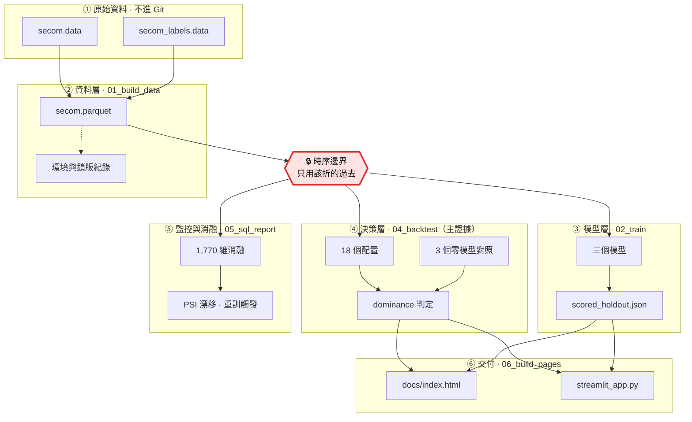

# 從 AUC 到部署決策：半導體品質檢查的成本敏感評估

> 在類別不平衡、檢查產能受限與資料漂移下，模型真的比全檢或隨機抽檢更省成本嗎？

[](https://github.com/mina201199/secom-cost-sensitive-eval/actions/workflows/ci.yml)

**▶ [互動試算頁](https://mina201199.github.io/secom-cost-sensitive-eval/)** — 不需安裝，點開就能改成本與產能假設看策略怎麼變

[English](README.md) · [最新實驗報告](reports/executive_summary.md)

**問題的形狀：** 要篩的東西很多、真正有問題的不到 5%（四個評估窗合計 4.7%）、能動用的檢查量有上限、漏掉一個的代價是查一個的 **30 倍**，而且資料分布會隨時間漂移。誰該優先被檢查？

這個形狀不是半導體獨有的 —— 在製造業它是加驗排程，在銀行是洗錢警示分流與盜刷人工覆核，在醫療是篩檢分流。本專題以公開的 [UCI SECOM](https://archive.ics.uci.edu/dataset/179/secom) 半導體良率資料集為載體。

**多數專案問「模型準不準」，這個專題問「模型值不值得用」**：把有限的檢查名額按模型分數去配置，總成本會不會低於完全不用模型。這是部署決策，不是準確度競賽 —— 所以對照組是「永遠全檢」和「隨機抽檢」，不是另一個模型。

## 結論先講

**答案是不會 —— 而這個專題的價值在於它量化了為什麼。**

以滾動原點回測比較 18 個「模型 × 策略 × 產能」配置，對照三個完全不需要模型的固定策略：

| 產能情境 | 零模型最佳策略 | 成本／筆 | 最便宜的模型導向配置 | 成本／筆 | 贏過零模型的配置數 |
| --- | --- | ---: | --- | ---: | :---: |
| 無限制 | 永遠全檢 | **2,000** | majority/robust\* | 2,000 | **0 / 9** |
| 最多加驗 20% | 按配額隨機加驗 | **2,644** | lgbm/threshold | 2,677 | **0 / 9** |

\* `majority` 是零資訊 DummyClassifier，保守策略退化成 100% 加驗 —— 那個 2,000 就是全檢掛了模型的名字，追平而非勝過（判定用嚴格小於）。真正用排序的配置都更貴，最便宜的是 `lgbm/robust` 的 2,042。

四個量化結果支持這個結論：

- **門檻可以事先算出來。** R = 漏放／加驗成本，p = 盛行率。p·R ≥ 1 時（本例 1.40），模型有價值的充要條件化簡成 **lift > 1**：同配額下挑的批次要比隨機更濃。實測四折中位數 **0.86**。
- **置換檢定 p = 0.52。** 模型標記的批次與同配額隨機抽出的批次，成本上無法區分。
- **成本差的 95% bootstrap 區間跨過零**（相對節省 −23.5% ~ +15.9%），只有 43.6% 的重抽樣本模型較便宜。
- **這個設計看不見小訊號。** 33 個正樣本可偵測的最小 ROC-AUC 是 **0.644**，實測約 0.5 —— 不證明有用也不證明無用，證明的是資料量回答不了。偵測 AUC 0.60 要約 69 筆 fail（2.1 倍）。


機制是漂移。以第一折訓練窗為參考，590 欄裡 452 欄算得出 PSI（其餘 138 欄在該窗全缺值 16、零變異 122，切不出分位桶，PSI 未定義而非 0）。這 452 欄中 PSI > 0.25 的比例在四個窗單調上升 **61% → 64% → 70% → 75%**。模型不是學不到，是被要求在沒見過的分布上外插。


所有數字由腳本統一產生，以[實驗報告](reports/executive_summary.md)為準。舊版的 +12.4%、8.7:1 與回測百分比已作廢。

## 資料與業務假設

[UCI SECOM](https://archive.ics.uci.edu/dataset/179/secom) 提供 1,567 筆觀測、104 筆 fail。感測器檔有 590 欄且匿名；4.5% 的儲存格缺值，116 欄零變異。UCI 網頁的欄位數與原始檔不符，本專案以實際解析結果為準。

標籤是廠內測試結果，不是客戶端退貨。以下都是情境假設：一筆觀測等於一個可獨立加驗單位、加驗必定攔截選中的不良品、加驗 2,000 與漏放 60,000 TWD。真實部署還要確認感測器在決策時已可取得。

**成本假設本身決定了難度。** 2,000 : 60,000 讓 p·R = 1.40 > 1，把情境放進「模型只需贏過隨機抽驗」這個對它最寬鬆的區域。實測沒有贏。

## 如何避免評估過度樂觀

- 外層依時間切分；每折的前處理、內部 CV 分箱與訓練只用該折可取得的歷史。
- 最終棵數由 CV 決定；較早的 OOF 校準模型用預先固定的棵數，避免後續標籤反向影響調參。
- 校準窗同時用於校準與策略選擇，因此不當作獨立成績，只在下一個時間窗評分。
- 每個成本比都在驗證窗重選門檻、在未來窗計價。以測試集最佳化門檻的部署損益兩平宣稱已取消。
- 三個模型、三種策略、兩種產能共用相同時間窗；基準由校準窗事先選定，不在看完未來標籤後挑。
- **但事前選定的基準會挑錯**，所以主結論改用固定的零模型策略當門檻 —— 它連挑錯的機會都沒有，更難反駁。
- 保留沒有 fail 的評估窗：成本照算，無定義指標記為空值。末折納入剩餘資料。
- SQL 消融對全部原始感測器建歷史特徵，不用測試集 SHAP 排名挑特徵。

分位數策略假設一整批決策的分數可以一起取得，所以這是批次配置評估、不是逐筆即時部署；同分邊界一起排除，實際加驗量可能少於上限。SQL 同時間戳以輸入列順序處理。

## 已知會被追問，所以主動揭露

- **「保守」策略不是穩健化，是切換成接近全檢的開關。** Clopper–Pearson 上界把漏放成本放大 1.42–1.95 倍（各折），使 p·λ·R 跨過 1，最佳加驗比例因此貼到上限（四折選出 86%／28%／98%／95%）。它的改善來自加驗比例，不是排序。
- **校準對三個策略的影響不一樣。** Platt 是單調變換，分位數與保守分位數只用排序，所以校準完全不改變這兩者的決策，只有絕對門檻會用到機率尺度。`test_calibration_does_not_change_rank_based_decisions` 直接驗證。
- **`min_estimators: 10` 這個下限確實在生效**，不是備而不用的保險。落在下限代表內層 CV 平均 AUC 在不到 10 棵樹就達峰後轉降。
- **AUC 刻意不當重訓觸發條件。** 在 33 個正樣本的量級上它的抖動大於任何真實變化，當觸發器只會製造假警報。

## 研究設計

| 面向 | 比較內容 |
| --- | --- |
| 模型 | Dummy prior、L2 Logistic Regression、LightGBM |
| 策略 | 絕對門檻、分位數、基準率上界調整的保守分位數 |
| 情境 | 無產能限制、最多加驗 20% |
| 零模型對照 | 永遠不檢、永遠全檢、按整數配額隨機加驗 |
| 評估 | PR-AUC、ROC-AUC、Brier、lift@20%、攔截率、成本、各折差異 |
| 不確定性 | 可偵測效果量、成本差 bootstrap 區間、對隨機抽驗的精確置換檢定 |
| 監控 | 盛行率體制判定（綁在損益兩平線）、特徵 PSI、重訓觸發規則 |
| 消融 | 590 個原始感測器 vs 加入 1,180 個歷史偏離特徵 |

SHAP 是描述性分析，不能回推匿名感測器的實體意義或因果。

## 架構

從兩個 UCI 原始檔到一頁能改假設的靜態試算頁，中間六層。紅色那格是防洩漏的核心。



紅框是整條流程最緊的地方。只有 1,567 列、104 個 fail，一點未來資訊漏進訓練就足以讓結論翻面 —— 而成本敏感的專案最常見的作弊正是拿測試集挑門檻，這個 repo 犯過，舊版的損益兩平宣稱因此撤掉。上一節那八條規則就是這格的內容，由 `tests/test_no_leakage.py` 守著。

兩個刻意的畫法：**三個零模型對照不經過模型層**，因為它們不需要模型，這正是主結論的比較基準；**`03_decide.py` 沒有畫**，它只處理單次切分，是附錄而非結論來源。

## 重現

```bash
pip install -e ".[dev]"
python scripts/01_build_data.py
python scripts/02_train.py
python scripts/03_decide.py
python scripts/04_backtest.py
python scripts/05_sql_report.py
python scripts/06_build_pages.py
python -m pytest tests/
ruff check .
streamlit run app/streamlit_app.py
```

請依序執行：03 產生單次切分報告（附錄），04 產生主結論與不確定性量化，05 再加消融與漂移監控。整條約 40 秒。

**儀表板可以單獨跑，不必先訓練。** 它只讀兩個進版控的小檔（`scored_holdout.json` 約 20 KB 與 `backtest.json`），不碰 7.5 MB 的 `models/fitted.pkl` 也不碰 `data/` —— clone 完直接 `streamlit run` 就會動，這也是它能部署到託管平台的原因（`requirements.txt` 第一行的 `.` 就是為此）。側邊欄操作的是附錄那個單次切分情境。

**Windows 請 clone 到短路徑。** 路徑太深時 `pip install -e ".[dev]"` 會在解壓 Streamlit 時失敗（`OSError: [Errno 2] No such file or directory`）。那是 Windows 260 字元的 `MAX_PATH` 上限，不是本專案的問題 —— Streamlit 內部目錄夠深，clone 路徑一長就超過。換 `C:\dev\secom` 之類的短路徑即可。

`requirements.txt` 是相容版本下限（意圖）；`requirements-lock.txt` 與 `environment.json` 是驗證環境的實際版本（事實），由 `01_build_data.py` 從已安裝套件的中介資料產生，不手動維護。固定種子有助重現，但換版本或平台仍可能改變結果；**不宣稱**跨環境 byte-identical。

### 乾淨環境實測

從 GitHub clone 到全新 venv、照上面的指令跑到底，實測一次：

| 項目 | 結果 |
| --- | ---: |
| clone 大小 | 2.6 MB（工作檔 1.3 MB ＋ `.git` 1.3 MB） |
| `pip install -e ".[dev]"` | 200 秒 —— 受下載速度支配，只當數量級看 |
| 01 → 06 整條流程（含 UCI 下載） | **42 秒** |
| `pytest tests/` | 76 passed，10 秒 |
| `ruff check .` | 通過 |
| dashboard `healthz` | 200，約 2 秒 |

計時全部來自那一次 clean clone；測試數之後因新增守門測試而上升，秒數沒有重測（數量是程式碼的性質，秒數不是）。那次環境把多數相依解析成與記錄不同的版本（pandas 跨主版本到 3.0.6、scikit-learn 1.9.1、matplotlib 3.11.2），而 `reports/executive_summary.md` 仍與已提交版本**位元組完全相同**。

**不相同的部分值得講精確**，否則容易被誤讀成更強的宣稱。九張圖不同（換了 matplotlib，PNG 位元組就不同）；三個 JSON 合計 **42 個數值欄位有差，最大相對差 3.3 × 10⁻¹⁴**，全是門檻與浮點指標。**沒有任何整數欄位改變** —— 攔截數、漏放數、窗大小、配置數全部一致，這才是每個離散結論都不受影響的原因。這仍是觀察而非保證：兩次重現不足以支持跨版本穩定的宣稱。

## 檔案導覽

- `secom/models.py`：模型、每折前處理、內部時序 CV 與校準。
- `secom/decision.py`：成本、門檻、產能限制、事前基準，以及 `required_lift` 的推導。
- `secom/backtest.py`：相同未來窗的模型與策略比較，加上 `reference_costs` 的零模型對照。
- `secom/stats.py`：可偵測效果量、成本差 bootstrap、對隨機抽驗的精確置換檢定。
- `secom/drift.py`：盛行率體制判定、特徵 PSI 與重訓觸發規則。
- `secom/sql.py`：DuckDB 側寫與前 20 筆歷史特徵。
- `secom/provenance.py`：指標 JSON、環境紀錄與鎖版檔（「跑了什麼、在什麼環境」）。
- `secom/reporting.py`：把那些 JSON 渲染成報告（「怎麼說」），每個 `_xxx_lines` 對應一個章節。
- `reports/metrics/scored_holdout.json`：驗證／測試窗的標籤與校準後機率。儀表板只要 y 與 p 兩個陣列，所以模型與資料不必進版控。
- `app/streamlit_app.py`：互動試算。主結論固定置頂、直接讀 `backtest.json` 的 dominance，避免「報告說輸、儀表板說贏」的自相矛盾。
- `scripts/06_build_pages.py`：把兩個 JSON 烘成零依賴靜態頁。網址從 `pyproject.toml` 讀出來寫進 HTML，改 repo 名不必手改前端。
- `docs/index.html`：GitHub Pages 的互動試算頁，由 06 產生並進版控。純前端，點連結就能用。
- `tests/`：標籤隔離、前處理隔離、門檻選擇、零 fail、產能、保守策略退化、校準排序不變性、SQL 與漂移的回歸測試。另外三支守文件本身：`test_stats.py` 用解析解釘住 bootstrap、置換檢定與檢定力，`test_documented_counts.py` 讓文件寫的數量無法過期，`test_architecture_diagram.py` 讓架構圖無法指向不存在的檔案。
- `.github/workflows/ci.yml`：ruff 加全套測試。CI 會下載 UCI 原始檔 —— 76 個測試裡有 13 個需要資料，而那 13 個正好是全部的洩漏防護測試，沒有資料的 CI 只是一個綠色徽章。

程式碼慣例：註解與 docstring 用中文說明「為什麼」，圖表標籤與 JSON 鍵值用英文。行長上限 100，由 ruff 強制。

## 下一步

先取得新的未見時期資料、欄位時點語意與實際加驗成效，再做前瞻驗證。檢定力分析給出具體的量：偵測 AUC 0.60 需要約 69 筆 fail、1,468 筆觀測；AUC 0.55 需要約 275 筆 fail、5,872 筆觀測。

本次方法修正參考過舊回測，新增結果不能當作全新獨立驗證。四折與少量不良品不足以證明穩定泛化；**負面結果也不等於證明所有模型都沒有訊號** —— 它證明的是這個資料量、這個粒度、這組成本假設之下，這個問題無法被回答。

## 授權

MIT，見 [LICENSE](LICENSE)。UCI SECOM 原始資料不隨 repo 散布，由 `scripts/01_build_data.py` 從來源下載。
