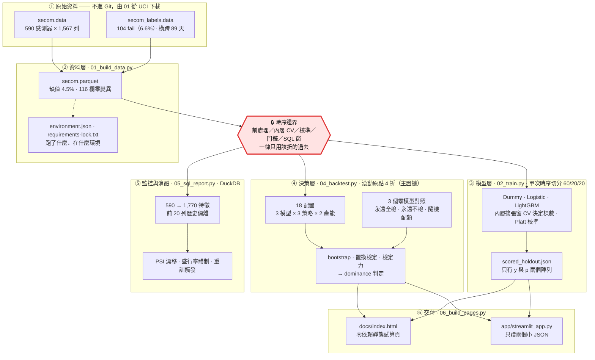

# 模型值不值得上線 —— 一次成本敏感的部署決策評估

[](https://github.com/mina201199/secom-cost-sensitive-eval/actions/workflows/ci.yml)

**▶ [互動試算頁](https://mina201199.github.io/secom-cost-sensitive-eval/)** — 不需安裝，點開就能改成本與產能假設看策略怎麼變

[English](README.md) · [最新實驗報告](reports/executive_summary.md)

**問題的形狀：** 要篩的東西很多、真正有問題的不到 5%（四個評估窗合計 4.7%）、能動用的檢查量有上限、漏掉一個的代價是查一個的 **30 倍**，而且資料分布會隨時間漂移。誰該優先被檢查？

這個形狀不是半導體獨有的 —— 在製造業它是加驗排程，在銀行是洗錢警示分流與盜刷人工覆核，在醫療是篩檢分流。本專題以公開的 [UCI SECOM](https://archive.ics.uci.edu/dataset/179/secom) 半導體良率資料集為載體。

**多數專案問「模型準不準」，這個專題問「模型值不值得用」**：把有限的檢查名額按模型分數去配置，總成本會不會低於完全不用模型。這是部署決策，不是準確度競賽 —— 所以對照組是「永遠全檢」和「隨機抽檢」，不是另一個模型。

## 結論先講

**答案是不會 —— 而這個專題的價值在於它量化了為什麼。**

在 UCI SECOM 上，以滾動原點回測比較 18 個「模型 × 策略 × 產能」配置，並與三個完全不需要模型的固定策略對照：

| 產能情境 | 零模型最佳策略 | 成本／筆 | 最便宜的模型導向配置 | 成本／筆 | 贏過零模型的配置數 |
| --- | --- | ---: | --- | ---: | :---: |
| 無限制 | 永遠全檢 | **2,000** | majority/robust\* | 2,000 | **0 / 9** |
| 最多加驗 20% | 按配額隨機加驗 | **2,644** | lgbm/threshold | 2,677 | **0 / 9** |

\* 這一格要看清楚：`majority` 是零資訊的 DummyClassifier，它的保守策略退化成 100% 加驗，所以那個 2,000 就是「永遠全檢」本身，只是掛了模型的名字 —— 它追平零模型而非勝過它（判定用嚴格小於）。真正用到排序能力的配置全部更貴：無限制情境最便宜的 LightGBM 配置是 `lgbm/robust` 的 2,042。

支持這個結論的四個量化結果：

- **門檻高度可以事先算出來。** 令 R = 漏放成本／加驗成本、p = 盛行率。當 p·R ≥ 1（本例 1.40），模型要有價值的充要條件化簡成 **lift > 1** —— 同樣的加驗配額，模型挑的批次裡不良品濃度要高於隨機抽樣。實測 lift@20% 的四折中位數是 **0.86**。
- **置換檢定 p = 0.52。** 模型標記的批次組與同配額隨機抽出的批次組，在成本上無法區分。
- **成本差的 95% bootstrap 區間跨過零**（相對節省 −23.5% ~ +15.9%），只有 43.6% 的重抽樣本模型較便宜。
- **這個設計本來就看不見小訊號。** 33 個正樣本可偵測的最小 ROC-AUC 是 **0.644**；實測在 0.5 附近，因此既不證明模型有用、也不證明無用 —— 它證明的是資料量無法回答這個問題。要偵測 AUC 0.60 需要約 69 筆 fail（2.1 倍）。


漂移分析給出機制：以第一折訓練窗為參考，590 個感測器裡有 452 個算得出 PSI —— 其餘 138 欄在該窗全缺值（16 欄）或零變異（122 欄），切不出分位桶，PSI 是未定義而不是 0。在這 452 個之中，PSI > 0.25 的比例在四個評估窗單調上升 **61% → 64% → 70% → 75%**。模型不是學不到東西，而是被要求在它從未見過的分布上外插。


完整數字、假設與限制由腳本統一產生，請以[實驗報告](reports/executive_summary.md)為準。舊版的 +12.4%、8.7:1 與回測百分比不再作為本版結論。

## 資料與業務假設

[UCI SECOM](https://archive.ics.uci.edu/dataset/179/secom) 提供 1,567 筆觀測，原始感測器檔有 590 欄，104 筆 fail。欄位匿名，且存在缺值。UCI 網頁的欄位數描述與原始檔不同，本專案以實際解析檔案及測試檢查為準。

資料標籤是廠內測試結果，並非客戶端退貨。把一筆觀測視為一個可獨立加驗單位、加驗必定攔截被選中的不良品，以及加驗 2,000／漏放 60,000 TWD，都是情境假設。真實部署還需確認感測器在決策時已可取得。

**成本假設本身決定了實驗的難度。** 2,000 : 60,000 讓 p·R = 1.40 > 1，也就是把情境放進「模型只需要贏過隨機抽驗」的區域 —— 這是對模型最寬鬆的一個區域。實測沒有贏。

## 如何避免評估過度樂觀

- 外層依時間切分；各折的前處理、內部 CV 分箱與模型訓練只使用可取得的歷史資料。
- CV 決定最終 LightGBM 棵數。較早 OOF 校準模型使用預先固定棵數，避免後續標籤反向影響其調參。
- 校準窗同時用於校準與策略選擇，該窗不當作獨立成績；只在下一個時間窗評分。
- 每個成本比在驗證窗選門檻，在未來窗計算成本。取消以測試集最佳化門檻所得的部署損益兩平宣稱。
- 三個模型、三種策略、兩種產能情境採相同時間窗。基準也由校準窗事先選定，不在看完未來標籤後挑選。
- **但事前選定的基準會挑錯**，所以主結論改用固定不變的零模型策略當門檻 —— 它連挑錯的機會都沒有，因此更難反駁。
- 保留沒有 fail 的評估窗；成本照算，無定義指標記為空值。末折納入剩餘資料。
- SQL 消融對全部原始感測器建立歷史特徵，不再用測試集 SHAP 排名決定特徵。

分位數策略假設一段決策批次的分數可一起取得。這是批次配置評估，不是逐筆即時部署；同分邊界一起排除，因此實際加驗量可能少於上限。SQL 同時間戳以輸入列順序處理，假設該順序可代表觀測先後。

## 已知會被追問，所以主動揭露

- **「保守」策略不是穩健化方法，是「切換成接近全檢」的開關。** Clopper–Pearson 上界把漏放成本放大 1.42–1.95 倍（各折），使 p·λ·R 跨過 1，最佳加驗比例因此貼到上限（四折選出 86%／28%／98%／95%）。它的成本改善來自加驗比例，不是模型排序。
- **校準對三個策略的影響不一樣。** Platt 是單調變換，分位數與保守分位數只用排序，所以校準完全不改變這兩者的決策；只有絕對門檻會用到機率尺度。`test_calibration_does_not_change_rank_based_decisions` 直接驗證這件事。
- **`min_estimators: 10` 這個下限確實在生效**，不是備而不用的保險。落在下限代表內層 CV 的平均 AUC 在不到 10 棵樹就已達峰值後轉降。
- **AUC 刻意不列為重訓觸發條件。** 在 33 個正樣本的量級上它的抖動大於任何真實變化，當觸發器只會製造假警報。

## 研究設計

| 面向 | 比較內容 |
| --- | --- |
| 模型 | Dummy prior、L2 Logistic Regression、LightGBM |
| 策略 | 絕對門檻、分位數、基準率上界調整的保守分位數 |
| 情境 | 無產能限制、最多加驗 20% |
| 零模型對照 | 永遠不檢、永遠全檢、按整數配額隨機加驗 |
| 評估 | PR-AUC、ROC-AUC、Brier、lift@20%、攔截率、成本、各折差異 |
| 不確定性 | 可偵測效果量、成本差 bootstrap 區間、對隨機抽驗的精確置換檢定 |
| 監控 | 盛行率體制判定（綁在損益兩平線）、特徵 PSI、重訓觸發規則 |
| 消融 | 590 個原始感測器 vs 加入 1,180 個歷史偏離特徵 |

SHAP 是描述性分析，不能回推出匿名感測器的實體意義或因果。

## 架構

從 UCI 的兩個原始檔到一頁能改假設的靜態試算頁，中間六層。紅色那一格是防洩漏的核心。



紅框那一格是整條流程最緊的地方。只有 1,567 列、104 個 fail，任何一點未來資訊漏進訓練都足以讓結論翻面 —— 而成本敏感的專案最常見的作弊，正是拿測試集去挑門檻。這個 repo 犯過，舊版的部署損益兩平宣稱已經因此撤掉。

現在的規則是：每一折重新 fit 前處理、重新跑內層 CV、重新校準、重新選門檻，全部只用該折的訓練窗；門檻在校準窗定案、只在**下一個**時間窗計價；SQL 的歷史特徵窗不含當前列。這條線由 `tests/test_no_leakage.py` 守著，而 CI 一定要下載 UCI 原始檔，就是為了讓那批測試真的跑得到、而不是在沒有資料時被安靜跳過。

兩個刻意的畫法：**④ 的三個零模型對照不經過模型層**，因為它們完全不需要模型——這正是主結論的比較基準。**`03_decide.py` 沒有畫進去**，它只處理單次時間切分，是對照用的附錄而非結論來源。

## 重現

```bash
pip install -e ".[dev]"
python scripts/01_build_data.py
python scripts/02_train.py
python scripts/03_decide.py
python scripts/04_backtest.py
python scripts/05_sql_report.py
python scripts/06_build_pages.py
python -m pytest tests/
ruff check .
streamlit run app/streamlit_app.py
```

請依序執行。03 先寫單次切分報告（僅供對照，已降級為附錄），04 產生主結論與不確定性量化，05 再加入消融與漂移監控。整條流程約 40 秒。

**Windows 請 clone 到短一點的路徑。** 路徑太深時，`pip install -e ".[dev]"` 會在解壓 Streamlit 時失敗，訊息是 `OSError: [Errno 2] No such file or directory`，結尾像 `streamlit/.agents/skills/.../dashboard-companies/streamlit_app.py`。那是 Windows 260 字元的 `MAX_PATH` 上限，不是這個專案的問題 —— Streamlit 內部的目錄夠深，clone 路徑一長就會超過。換到短路徑（例如 `C:\dev\secom`）是一步就好的解法；開啟 `LongPathsEnabled` 也可以，但要改登錄檔並重開機。

儀表板的側邊欄改變單次切分試算，回測表則顯示設定檔成本的既有實驗。

**儀表板可以單獨跑，不需要先訓練。** 它只讀兩個已進版控的小檔
（`reports/metrics/scored_holdout.json` 約 20 KB，以及 `backtest.json`），
不讀 7.5 MB 的 `models/fitted.pkl`，也不讀 `data/`。所以 clone 之後直接
`streamlit run app/streamlit_app.py` 就會動 —— 這也是它能部署到託管平台的原因。
`requirements.txt` 第一行的 `.` 就是為此：託管平台只跑 `pip install -r requirements.txt`，
不會跑 `pip install -e .`。

`requirements.txt` 是相容版本下限（意圖）；`requirements-lock.txt` 與 `reports/metrics/environment.json` 是本次驗證環境的實際版本（事實），兩者都由 `01_build_data.py` 從已安裝套件的中介資料產生，不手動維護。固定隨機種子有助重現，但不同套件版本與平台仍可能改變結果；**不宣稱**跨環境 byte-identical。

### 乾淨環境實測

從 GitHub clone 到全新 venv、照上面的指令跑到底，實測一次：

| 項目 | 結果 |
| --- | ---: |
| clone 大小 | 2.6 MB（工作檔 1.3 MB ＋ `.git` 1.3 MB） |
| `pip install -e ".[dev]"` | 200 秒 —— 受下載速度支配，只當數量級看 |
| 01 → 06 整條流程（含 UCI 下載） | **42 秒** |
| `pytest tests/` | 73 passed，10 秒 |
| `ruff check .` | 通過 |
| dashboard `healthz` | 200，約 2 秒 |

這次乾淨環境同樣把多數直接相依解析成與記錄不同的版本（pandas 跨主版本到 3.0.6、scikit-learn 1.9.1、matplotlib 3.11.2），而 `reports/executive_summary.md` 同樣與已提交的版本**位元組完全相同**。

**不相同的部分值得講精確**，否則「報告位元組相同」很容易被誤讀成一個比事實更強的宣稱。九張圖不同（換了 matplotlib，PNG 的位元組就不同）；`backtest.json`、`sql_ablation.json`、`model_scores.json` 合計 **42 個數值欄位有差，最大相對差 3.3 × 10⁻¹⁴**，全部是門檻與浮點指標。**沒有任何整數欄位改變** —— 攔截數、漏放數、窗大小、配置數全部一致，這才是每個離散結論都不受影響、而四捨五入後的報告會渲染成同一份的原因。

這仍然是觀察，不是保證：兩次重現不足以支持跨版本穩定的宣稱，上面那句「不宣稱 byte-identical」仍然成立。

## 檔案導覽

- `secom/models.py`：模型、每折前處理、內部時序 CV 與校準。
- `secom/decision.py`：成本、門檻、產能限制、事前基準，以及 `required_lift` 的門檻推導。
- `secom/backtest.py`：相同未來時間窗的模型與策略比較，加上 `reference_costs` 的零模型對照。
- `secom/stats.py`：可偵測效果量、成本差 bootstrap、對隨機抽驗的精確置換檢定。
- `secom/drift.py`：盛行率體制判定、特徵 PSI 與重訓觸發規則。
- `secom/sql.py`：DuckDB 側寫與前 20 筆歷史特徵。
- `secom/provenance.py`：指標 JSON、環境紀錄與鎖版檔（「跑了什麼、在什麼環境」）。
- `reports/metrics/scored_holdout.json`：驗證／測試窗的標籤與校準後機率。
  儀表板只需要 y 與 p 兩個陣列（下游全是純函式），所以模型與資料不必進版控。
- `secom/reporting.py`：把那些 JSON 渲染成報告（「怎麼說」）。每個 `_xxx_lines` 對應一個章節。
- `app/streamlit_app.py`：互動試算。主結論固定置頂且直接讀 `backtest.json` 的 dominance，
  避免出現「報告說模型輸、儀表板說 +12.7%」的自相矛盾；側邊欄操作的是報告附錄那個單次切分情境。
- `scripts/06_build_pages.py`：把 `backtest.json` 與 `scored_holdout.json` 烘成一個零依賴的靜態頁。
  網址從 `pyproject.toml` 的 `[project.urls]` 讀出來寫進 HTML，所以 repo 改名時不必手改前端。
- `docs/index.html`：GitHub Pages 的互動試算頁（由 06 產生、進版控）。純前端、不需要 Python 環境 ——
  作品集的連結要能讓人點一下就看到結果，不能先要求對方 clone 下來裝套件。
- `tests/`：標籤隔離、前處理隔離、門檻選擇、零 fail、產能、保守策略退化、校準排序不變性、SQL 與漂移的回歸測試。
  另外兩支守的是結論本身：`test_stats.py` 用解析解釘住 bootstrap 區間、置換檢定與
  檢定力推算（含「平手不算勝出」這條慣例），`test_documented_counts.py` 讓文件裡
  寫的測試數量無法再過期。
- `.github/workflows/ci.yml`：ruff 加全套測試。CI 會下載 UCI 原始檔 —— 73 個測試裡有 13 個需要資料，而那 13 個正好是全部的洩漏防護測試，沒有資料的 CI 只是一個綠色徽章。

程式碼慣例：註解與 docstring 用中文說明「為什麼這樣做」，圖表標籤與 JSON 鍵值用英文。行長上限 100，由 ruff 強制。

## 下一步

優先取得新的未見時期資料、欄位時點語意與實際加驗成效，再做前瞻驗證。檢定力分析給出了具體的量：要偵測 AUC 0.60 需要約 69 筆 fail、1,468 筆觀測；AUC 0.55 則需要約 275 筆 fail、5,872 筆觀測。

本次方法修正參考過舊回測，新增結果也不能當作全新獨立驗證。四折與少量不良品的結果不足以證明穩定泛化；**負面結果也不等於證明所有模型都沒有訊號** —— 它證明的是這個資料量、這個粒度、這組成本假設之下，這個問題無法被回答。

## 授權

MIT，見 [LICENSE](LICENSE)。UCI SECOM 原始資料不隨 repo 散布，由 `scripts/01_build_data.py` 從來源下載。
