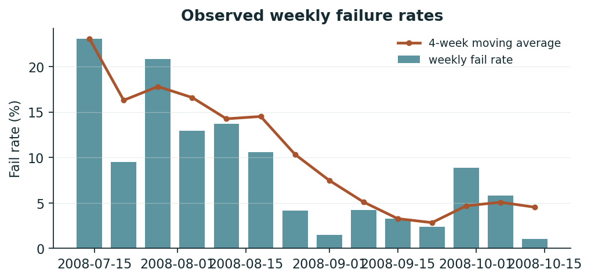

# 半導體不良品預測與加驗成本評估

> 本報告由實驗腳本自動更新。主要證據是滾動回測與零模型參考策略的比較；單次切分只在附錄供對照。

本專題研究：在小樣本、類別不平衡與時間分布改變下，模型能否協助配置加驗資源。

## 主結論

**在本專題的成本假設下，不需要模型的固定策略比全部 18 個模型導向配置都便宜；跨過門檻的配置數是 0 / 18。** 因此這份實驗不支持「用這個模型配置加驗資源」的結論；它支持的是一個負面結論，以及一組說明為什麼的量化條件。

### 零模型參考策略

這三個策略不看分數、不選門檻、不做校準，且從頭到尾固定不變 —— 連「事前挑錯」的機會都沒有。成本單位與下方比較表一致（每筆評估觀測，依窗大小加權）。

| 產能情境 | 零模型策略 | 可行 | 成本／筆 |
| --- | --- | :---: | ---: |
| unconstrained | 永遠不檢 | 是 | 2,805 |
| unconstrained | 永遠全檢 ←最便宜 | 是 | 2,000 |
| capacity_capped | 永遠不檢 | 是 | 2,805 |
| capacity_capped | 永遠全檢 | 否 | 2,000 |
| capacity_capped | 按配額隨機加驗 ←最便宜 | 是 | 2,644 |

### 有多少模型導向配置跨過了這個門檻

| 產能情境 | 零模型最佳 | 最便宜的模型導向配置 | 贏過零模型的配置數 |
| --- | ---: | --- | :---: |
| unconstrained | 永遠全檢 2,000 | majority/robust 2,000 | 0 / 9 |
| capacity_capped | 按配額隨機加驗 2,644 | lgbm/threshold 2,677 | 0 / 9 |

無限制情境那一列要特別讀清楚：最便宜的「模型導向」配置是 `majority/robust`，而 majority 是零資訊的 DummyClassifier，它的保守策略退化成 100% 加驗 —— 所以那個 2,000 就是「永遠全檢」本身，只是掛了模型的名字。真正用到排序能力的配置全部更貴。

### 為什麼：門檻高度是可以先算出來的

設加驗成本 1 單位、漏放成本 R = 30 倍、合併盛行率 p = 4.67%，則 p·R = 1.40。

p·R ≥ 1 表示加驗平均而言就是划算的，此時把關的零模型策略是「按配額隨機加驗」（無產能限制時即全檢），而模型導向策略要贏過它，條件化簡成一個很乾淨的形式：**lift 必須大於 1.00** —— 也就是「同樣的加驗配額，模型挑出來的批次裡，不良品濃度要高於隨機抽樣」。這個門檻與加驗比例無關；產能上限只改變哪一個零模型策略在把關，不改變門檻高度（推導見 `secom/decision.py` 的 `required_lift`）。

換句話說，本專題選定的成本假設把情境放進了「排序能力只需要贏過隨機抽驗」的區域 —— 這是對模型最寬鬆的一個區域。實測沒有贏。

## 問題與假設

- UCI SECOM：1,567 筆生產實體、590 個匿名感測器、104 筆 fail。
- 將一筆觀測視為一個可獨立加驗單位，是本專題的情境假設；資料未證明它代表整批產品。
- 假設加驗成本 2,000、漏放成本 60,000 TWD／單位，且加驗能攔截所有被選中的不良品。
- 原始標籤是廠內測試 pass/fail，並非真實客戶退貨；成本不是實際節省的財務紀錄。
- 感測器必須在決策時可取得；資料缺少站點語意，這項部署條件仍需實廠確認。

## 評估設計

外層依時間分成訓練、校準／選策略、未來評估。內層 CV 的欄位篩選與樹模型分箱各自只使用該折訓練資料。

LightGBM 的棵數由內部平均 AUC 曲線選出，並套用 config.yaml 的最低 10 棵限制。校準使用固定棵數的時序 OOF 預測加驗證窗；固定棵數避免用較晚標籤替較早 OOF 調參。校準模型與最終模型的訓練量及棵數不同，校準可轉移性仍是限制。

校準窗同時用來擬合校準器與挑策略，因此該窗的分數不是獨立成績；成績只在後續窗計算。所有模型與策略使用相同外層時間窗。零 fail 窗仍計算成本，無定義的 AUC／攔截率記為空值。

基準策略由校準窗事先選定：無限制時比較全檢與不檢；有產能限制時比較不檢與按上限均勻隨機加驗的期望成本。比較表的「節省中位數」分母就是這個事前選定的基準。**但這個基準會挑錯**，所以主結論改用固定不變的零模型策略當門檻，那是更嚴格、也更難反駁的比較對象。

分位數策略需要同一決策批次的所有分數，本回測假設整個評估窗為可一起排序的批次。它不是逐筆即時部署模擬。同分邊界一起排除以遵守上限，因此可能未用滿產能。

### 樹數下限確實在生效

config.yaml 的 `min_estimators: 10` 會在內層 CV 平均曲線的峰值落在 10 棵以下時覆寫它的選擇。它不是備而不用的保險 —— `unconstrained/lgbm/robust` 的四折結果是 103 棵（CV 峰值）／10 棵（CV 峰值）／21 棵（CV 峰值）／10 棵（下限覆寫），其中 **1 折是下限覆寫**。

被覆寫代表那個訓練窗上，平均 AUC 在不到 10 棵樹時就已經達到峰值、之後轉為下降 —— 模型幾乎立刻開始過擬合訓練窗，沒有可泛化的訊號可以累積。另有折的 CV 峰值本身就落在 10 棵，兩者棵數相同但成因不同，所以上面逐折標註來源。

這與下一節的檢定力分析、以及漂移分析指向同一件事，不是三個獨立的問題。

### 「保守」策略實際上在做什麼

保守策略把觀測到的基準率換成 Clopper–Pearson 上界，等效於把漏放成本放大 1.95／1.78／1.85／1.42 倍（各折）。放大後的成本比讓最佳加驗比例直接貼到上限：unconstrained/lgbm/robust 的四折選出的加驗比例是 86%／28%／98%／95%，其中 3 折在 80% 以上。

**這意味著它不是一個穩健化方法，而是一個「切換成接近全檢」的開關。**它的成本改善主要來自加驗比例本身，不是來自模型排序 —— 這也是為什麼零資訊的 majority 模型配上同一個策略會得到更低的成本。

### 校準對這三個策略的影響不一樣

Platt scaling 是單調遞增變換，而分位數與保守分位數策略只使用分數的**排序**。因此校準完全不改變這兩個策略的決策，只有「絕對門檻」策略會用到機率的尺度。

這一點值得明說，因為成本計算的形式（期望成本 = P(fail) × 損失）看起來像是「必須先校準」，但本專題三個策略裡有兩個其實不吃機率值。測試 `test_calibration_does_not_change_rank_based_decisions` 直接驗證這件事。

## 相同時間窗的模型與策略比較

「節省中位數」與「最差折」的分母是校準窗事前選定的基準（見上）。要判斷模型有無價值，請看主結論那張零模型比較表，不要看這一欄。

| 情境／模型／策略 | 成本／筆 | 事前基準／筆 | 節省中位數 | 最差折 | ROC-AUC 中位數 | lift@20% 中位數 | 總攔截 | 總漏放 |
| --- | ---: | ---: | ---: | ---: | ---: | ---: | ---: | ---: |
| unconstrained/majority/threshold | 2,958 | 2,958 | +0.0% | +0.0% | 0.500 | 0.98 | 10 | 23 |
| unconstrained/majority/quantile | 2,958 | 2,958 | +0.0% | +0.0% | 0.500 | 0.98 | 10 | 23 |
| unconstrained/majority/robust | 2,000 | 2,958 | +1.1% | +0.0% | 0.500 | 0.98 | 33 | 0 |
| unconstrained/logreg/threshold | 2,742 | 2,958 | +3.8% | -38.6% | 0.431 | 0.69 | 14 | 19 |
| unconstrained/logreg/quantile | 2,759 | 2,958 | +5.9% | -35.2% | 0.431 | 0.69 | 13 | 20 |
| unconstrained/logreg/robust | 2,575 | 2,958 | +2.8% | -6.8% | 0.431 | 0.69 | 20 | 13 |
| unconstrained/lgbm/threshold | 2,813 | 2,958 | +5.6% | -31.2% | 0.497 | 0.86 | 7 | 26 |
| unconstrained/lgbm/quantile | 2,850 | 2,958 | +2.5% | -30.1% | 0.497 | 0.86 | 7 | 26 |
| unconstrained/lgbm/robust | 2,042 | 2,958 | +10.6% | -30.1% | 0.497 | 0.86 | 27 | 6 |
| capacity_capped/majority/threshold | 2,805 | 2,835 | +0.0% | -0.4% | 0.500 | 0.98 | 0 | 33 |
| capacity_capped/majority/quantile | 2,805 | 2,835 | +0.0% | -0.4% | 0.500 | 0.98 | 0 | 33 |
| capacity_capped/majority/robust | 2,805 | 2,835 | +0.0% | -0.4% | 0.500 | 0.98 | 0 | 33 |
| capacity_capped/logreg/threshold | 2,762 | 2,835 | -0.5% | -20.0% | 0.431 | 0.69 | 4 | 29 |
| capacity_capped/logreg/quantile | 2,722 | 2,835 | +0.4% | -18.3% | 0.431 | 0.69 | 4 | 29 |
| capacity_capped/logreg/robust | 2,705 | 2,835 | +2.1% | -18.3% | 0.431 | 0.69 | 5 | 28 |
| capacity_capped/lgbm/threshold | 2,677 | 2,835 | -1.0% | -15.5% | 0.497 | 0.86 | 3 | 30 |
| capacity_capped/lgbm/quantile | 2,759 | 2,835 | -9.0% | -18.3% | 0.497 | 0.86 | 3 | 30 |
| capacity_capped/lgbm/robust | 2,759 | 2,835 | -9.0% | -18.3% | 0.497 | 0.86 | 3 | 30 |

預先指定展示的配置 `unconstrained/lgbm/robust`：4 個評估窗，共 706 筆、33 筆 fail，攔截 27 筆。
把不良品視為獨立同分布二項試驗時，合併攔截率的 95% Clopper–Pearson 區間為 64.5%–93.0%。時間依賴與漂移可能使此假設失效；此區間不保證未來安全，也不是成本的信賴區間。

注意 ROC-AUC 中位數這一欄：logreg 在四個窗一致低於 0.5，lgbm 在 0.5 附近。三個模型有兩個在或低於隨機水準，這不是「證據有限」，而是「在這個粒度上這份資料沒有可利用的時序訊號」這個結論本身的證據。

## 統計不確定性：這個設計看得見多大的訊號

### 可偵測效果量

評估窗共 706 筆、33 筆 fail。在 α = 0.05、檢定力 80% 之下，這個樣本量可偵測的最小 ROC-AUC 是 **0.644**（Mann–Whitney 虛無變異數近似）。

實測 ROC-AUC 中位數在 0.5 附近，落在「任何小於 0.64 的真實訊號都看不見」的區間裡。**這既不證明模型有用，也不證明模型無用** —— 它證明的是這個資料量無法回答這個問題。要把它變成可回答的，需要：

| 想偵測的 AUC | 需要的 fail 筆數 | 需要的觀測筆數 | 相對現況 |
| ---: | ---: | ---: | ---: |
| 0.65 | 31 | 653 | 0.9× |
| 0.60 | 69 | 1,468 | 2.1× |
| 0.55 | 275 | 5,872 | 8.3× |

### 成本指標的解析度

706 筆評估觀測、漏放成本 60,000，因此多攔或少攔**一筆**不良品就等於每筆成本相差 85 TWD。

比較表裡 `unconstrained/lgbm/robust` 的「節省中位數 +10.6%」相對於事前基準 2,958 等於 313 TWD／筆，也就是約 **3.7 筆不良品的差別**。整個百分比建立在三到四筆觀測上。

### 成本差的 bootstrap 區間

在每一折內重抽觀測（折的大小固定，不跨折混合），零模型策略的成本隨同一次重抽一起變動，所以比較是配對的。零模型策略在原始資料上事前選定，不在每次重抽裡重新挑。

| 配置 | 對照的零模型策略 | 模型成本 95% CI | 相對節省 95% CI | 模型較便宜的重抽比例 |
| --- | --- | ---: | ---: | ---: |
| unconstrained/lgbm/robust | 永遠全檢 | 1,683 – 2,470 | -23.5% ~ +15.9% | 43.6% |
| capacity_capped/lgbm/robust | 按配額隨機加驗 | 1,909 – 3,680 | -13.2% ~ +7.2% | 20.6% |

兩個情境的相對節省區間都跨過零。「永遠全檢」的成本不隨標籤變動（固定等於加驗成本），所以它那一列的基準區間是退化的單點 —— 這正是它作為門檻難以反駁的原因。

### 排序是否勝過同配額隨機（精確置換檢定）

虛無假設是「被標記的批次組與標籤無關」。加驗筆數固定，因此落進標記組的不良品數服從超幾何分布，不需要真的打亂資料，直接抽樣就是精確的置換分布。這一項刻意只檢定 `required_lift` 指出的那個唯一門檻。

| 配置 | 實測成本／筆 | 虛無平均 | 虛無 95% 區間 | 單尾 p 值 |
| --- | ---: | ---: | ---: | ---: |
| unconstrained/lgbm/robust | 2,042 | 2,022 | 1,788 – 2,297 | 0.522 |
| capacity_capped/lgbm/robust | 2,759 | 2,835 | 2,589 – 3,014 | 0.352 |

p 值遠離顯著水準，且實測成本落在虛無分布的中央 —— 也就是說模型挑出來的批次組，與同配額隨機抽出來的批次組在成本上無法區分。這是本專題最直接的否證結果。

## 歷史特徵消融

為排除測試集 SHAP 選特徵的影響，全部 590 個感測器各增加前 20 筆均值偏離量與標準化偏離量，共 1,180 個歷史特徵。此實驗與舊版「只選 40 個」不同，不直接沿用舊結論。

| 特徵 | 維度 | 成本／筆 | 加驗率中位數 | 漏放 | ROC-AUC 中位數 | 最差節省 |
| --- | ---: | ---: | ---: | ---: | ---: | ---: |
| raw | 590 | 2,042 | 90.4% | 6 | 0.497 | -30.1% |
| all_sensor_history | 1770 | 1,881 | 96.3% | 3 | 0.504 | +2.2% |

此表為無產能限制情境。兩列的加驗率中位數都在 90% 以上 —— 也就是說 1,180 個歷史特徵買到的不是「更好的排序」，而是「可以少驗幾個百分點的批次」，而這個差距是在 33 個正樣本上量到的。不能把成本改善歸因於模型排序，也不能證明統計顯著改善。

## 漂移監控與重訓觸發

一般的漂移偵測會說「分布變了就告警」。在這裡那是錯的關注點 —— 分布天天在變，我們真正在意的是**最佳動作有沒有翻轉**。

由 `required_lift` 的推導，動作的分界就在損益兩平盛行率 p\* = c_inspect / c_escape = **3.33%**。盛行率在 p\* 之上，零模型的最佳動作是「按配額加驗」；在 p\* 之下是「完全不檢」。所以告警條件是「有證據顯示盛行率已經跨過 p\*」，而不是某個統計量抖動了。

**規則（任一成立即重訓）**

1. 當前窗盛行率的 95% Clopper–Pearson 區間整段落在 p\* = 3.33% 的另一側，且與參考窗的判定不同。
2. PSI > 0.25 的特徵超過可用特徵的 10%。缺值自成一桶 —— 在製程資料裡「某站點當時沒量到」本身帶訊息。

**AUC 刻意不列為觸發條件。** 在 33 個正樣本的量級上可偵測的最小 AUC 約 0.64（見上一節），AUC 的抖動大於任何真實變化，拿它當觸發器只會製造假警報。

參考窗：626 筆、65 筆 fail，截止於 2008-09-01。模擬「模型在此時點被訓練並部署」，然後逐一檢查每個後續評估窗。

| 評估窗 | 期間 | 盛行率 | 95% 區間 | 體制判定 | PSI>0.25 特徵 | 動作 |
| ---: | --- | ---: | --- | --- | ---: | --- |
| 1 | 2008-09-16 – 2008-09-23 | 3.41% | 1.26% – 7.27% | 無法判定 | 276 / 452 | **觸發重訓** |
| 2 | 2008-09-23 – 2008-10-01 | 3.41% | 1.26% – 7.27% | 無法判定 | 291 / 452 | **觸發重訓** |
| 3 | 2008-10-01 – 2008-10-07 | 9.66% | 5.73% – 15.01% | 該加驗 | 316 / 452 | **觸發重訓** |
| 4 | 2008-10-07 – 2008-10-17 | 2.25% | 0.62% – 5.65% | 無法判定 | 339 / 452 | **觸發重訓** |

### 結果：4 / 4 個窗觸發重訓

全部由**輸入漂移**觸發（4 個窗），而且超標比例隨時間單調上升：61% → 64% → 70% → 75%。離訓練窗越遠，移位的感測器越多。

**這是上一節「ROC-AUC 中位數在 0.5 附近」的機制。** 模型不是學不到東西，而是被要求在它從未見過的分布上外插 —— 到最後一個窗，四分之三的感測器已經不再像訓練時的樣子。在這種條件下，排序能力歸零並不意外。

另一件值得注意的事：3 / 4 個窗的盛行率區間跨過 p\*，規則誠實地回報「無法判定」。單一評估窗只有約 176 筆、4–17 筆 fail，區間寬到無法定位在損益兩平線的哪一側。

也就是說：**在這個窗大小之下，連「該不該加驗」這個二元決策都沒有足夠的統計證據可以做**，更不用說排序哪些批次該加驗。

要讓這條監控規則能真的驅動動作，需要更大的窗或更高的盛行率 —— 這與上一節檢定力分析指向的方向一致，也是「取得更多時期資料」這個下一步的具體理由。

## 附錄：單次時間切分（僅供對照，不是結論來源）

這一節保留是為了讓讀者看到單一切分與滾動回測的差異有多大，不是為了引用它的數字。門檻只由驗證集選定；每個成本比也重新在驗證集選門檻，再於測試集評分。

| 情境 | 加驗率 | 攔截率 | 漏放 | 每筆成本 | 相對事前基準節省 |
| --- | ---: | ---: | ---: | ---: | ---: |
| unconstrained | 70.1% | 94.1% | 1 | 1,592 | +20.4% |
| capacity_capped | 3.5% | 0.0% | 17.0 | 3,318 | -10.5% |

無限制那一列的加驗率是 70%，攔截率 94% —— 這又是同一個「接近全檢」的假影，不是排序能力的證據。單一切分只有一個時間窗、17 個正樣本，它的正號完全在滾動回測顯示的折間變異範圍之內。

成本比掃描是有限網格上的觀察，不推論「高於某一比值就永遠划算」。成本曲線遍歷測試門檻僅是事後診斷，不用於策略選擇。

## 限制與下一步

- 保守策略是基準率上界放大漏放成本的啟發式方法，不是對漂移下的個體風險或總成本提供保證；如上所述，它在本資料上退化成接近全檢。
- SHAP 用於描述模型對匿名欄位的依賴，不能推論因果、站點故障或具體改善參數。
- 優先取得更多時期資料、決策時點的欄位可用性、實際加驗成效與成本，再進行前瞻驗證。
- 若要逐筆或按天部署，需改用事先固定的歷史分數門檻或明確的每日批次，並重做回測。

[資料來源：UCI SECOM](https://archive.ics.uci.edu/dataset/179/secom)
